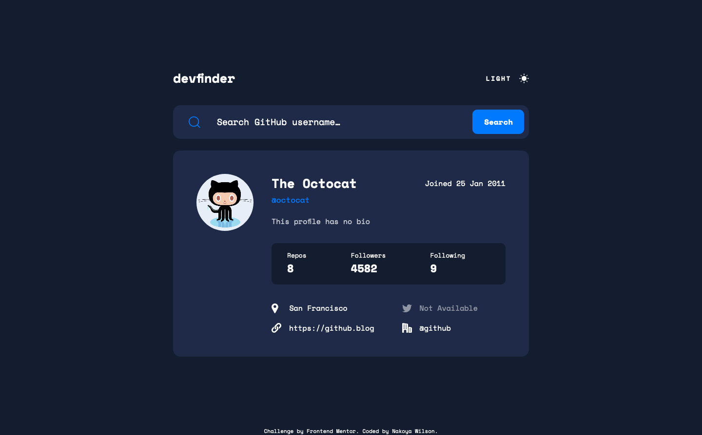

# Frontend Mentor - GitHub user search app solution

This is a solution to the [GitHub user search app challenge on Frontend Mentor](https://www.frontendmentor.io/challenges/github-user-search-app-Q09YOgaH6). Frontend Mentor challenges help you improve your coding skills by building realistic projects.

## Table of contents

- [Overview](#overview)
  - [The challenge](#the-challenge)
  - [Screenshot](#screenshot)
  - [Links](#links)
- [My process](#my-process)
  - [Built with](#built-with)
  - [What I learned](#what-i-learned)
  - [Continued development](#continued-development)
  - [Useful resources](#useful-resources)
- [Author](#author)
- [Acknowledgments](#acknowledgments)

## Overview

### The challenge

Users should be able to:

- View the optimal layout for the app depending on their device's screen size
- See hover states for all interactive elements on the page
- Search for GitHub users by their username
- See relevant user information based on their search
- Switch between light and dark themes
- **Bonus**: Have the correct color scheme chosen for them based on their computer preferences. _Hint_: Research `prefers-color-scheme` in CSS.

### Screenshot



### Links

- Solution URL: [https://www.frontendmentor.io/solutions/github-user-search-app-using-flexbox-and-css-grid-kunUaMOi6](https://www.frontendmentor.io/solutions/github-user-search-app-using-flexbox-and-css-grid-kunUaMOi6)
- Live Site URL: [https://nakoyawilson.github.io/github-user-search-app/](https://nakoyawilson.github.io/github-user-search-app/)

## My process

### Built with

- HTML
- CSS
- JavaScript
- Flexbox
- CSS Grid

### What I learned

While working through this project I learned about the prefers-color-scheme CSS media feature but I ended up removing the media queries from the project when I realised that my toggle theme button worked on Chrome but not Firefox.

```css
@media (prefers-color-scheme: dark) {
  body {
    background-color: #000;
    color: #fff;
  }
}

@media (prefers-color-scheme: light) {
  body {
    background-color: #fff;
    color: #000;
  }
}
```

### Useful resources

- [Labeling Controls](https://www.w3.org/WAI/tutorials/forms/labels/#note-on-hiding-elements) - This note was helpful for implementing hiding the input label for visual users.
- [prefers-color-scheme](https://developer.mozilla.org/en-US/docs/Web/CSS/@media/prefers-color-scheme)
- [How do I detect dark mode using JavaScript? - Stack Overflow](https://stackoverflow.com/questions/56393880/how-do-i-detect-dark-mode-using-javascript)
- [Rendering special characters in placeholder of input text box - Stack Overflow](https://stackoverflow.com/questions/38966750/rendering-special-characters-in-placeholder-of-input-text-box)

## Author

- Website - [Nakoya Wilson](https://nakoyawilson.netlify.app/)
- Frontend Mentor - [@nakoyawilson](https://www.frontendmentor.io/profile/nakoyawilson)
- Twitter - [@nakoyawilson](https://twitter.com/nakoyawilson)
- LinkedIn - [@nakoyawilson](https://www.linkedin.com/in/nakoyawilson/)
